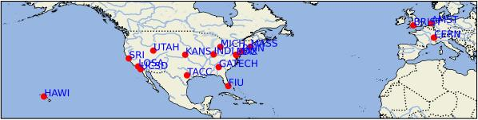
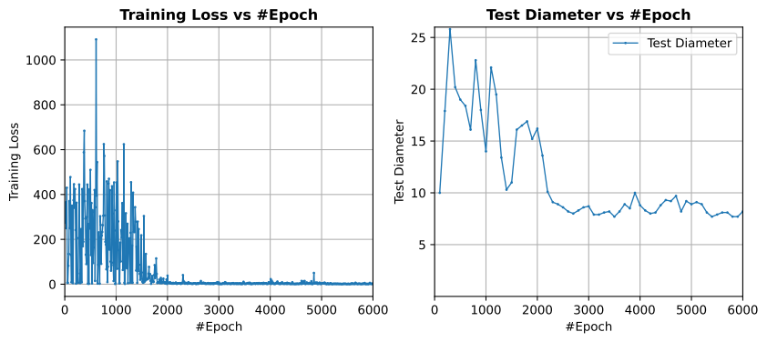
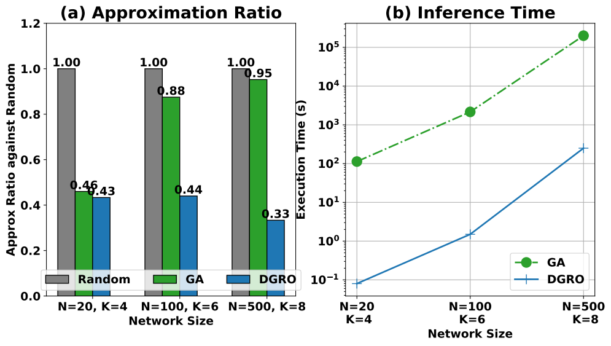
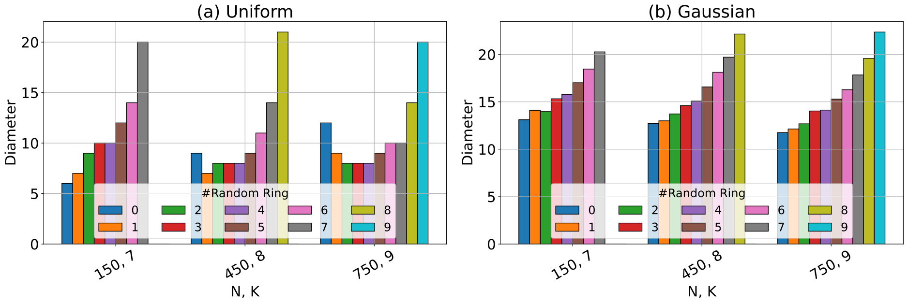
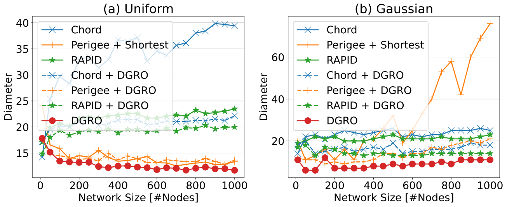
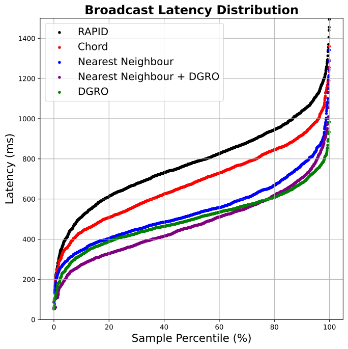
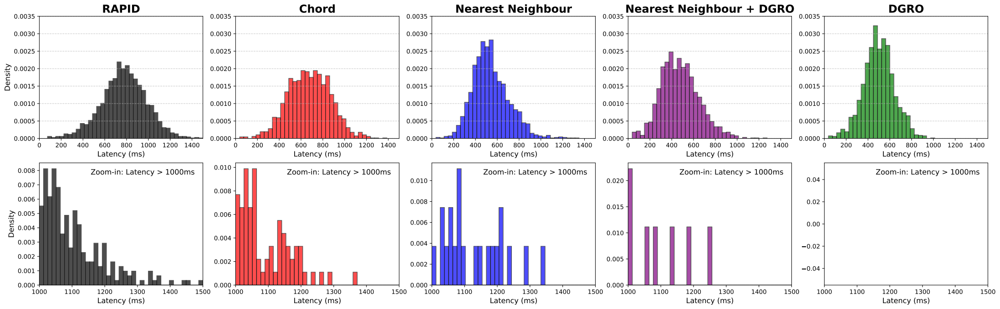
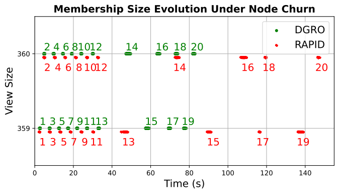
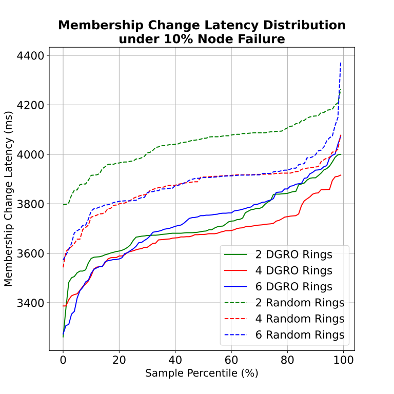

# DGRO: Diameter-Guided Ring Optimization for Integrated Research Infrastructure Membership




This repository contains the artifact for our research, including the **DGRO Java testbed**, **DQN reinforcement learning model**, and **PySimulator** for obtaining simulation results.

## 📌 Overview  

The artifact consists of three key components:  

1. **DGRO – Java Testbed**  
   - Implements the client/server service.  
   - Integrates the DGRO into the testbed.  

2. **DQN (Deep Q-Network) – Reinforcement Learning Module**  
   - Trains a reinforcement learning model to optimize decisions in the distributed system.  
   - Implements state, action, and reward structures.  

3. **PySimulator – Simulation Framework**  
   - Runs simulations based on the synthetic latency.  
   - Evaluates performance metrics such as latency and efficiency.  

## 🛠 Setting Up and Running the DGRO Service in JavaTestbed

### Prerequisites  

Ensure you have the following dependencies installed:  

- **Java 9+** (for DGRO)  
- **Python 3.8+** (for DQN and PySimulator)  
- **Maven** (for building DGRO)  
- **PyTorch** (for DQN training)  

---

The **javatestbed** implements a **server/client** service that enables users to deploy the **DGRO** protocol on distributed nodes. This guide provides steps to install and configure the service.

---

### **1. Downloading and Installing DGRO**
Users should **clone the repository** and install the **DGRO** service on the nodes where they want to participate in the protocol.

### **Clone the Repository**
```bash
cd DGRO
```

### **Build and Install**
```bash
mvn clean install
```

---

### **2. Configuring the Connection**
Users must modify the `experiment.yaml` file to configure the network settings.

#### **Example Configuration (`experiment.yaml`)**
```yaml
baseIP: "127.0.0.7"     # Seed node to join the cluster
myIP: "127.0.0.7"       # This node's IP address
port: 1234              # Port for this node
numNodes: 100           # Number of nodes to launch on this machine
targetNodes: 100        # Total cluster size (all nodes must wait for this count)
nodeId: 0               # Unique identifier for this node
targetServers: 1        # Number of servers involved (each server launches numNodes)
testId: "0"             # Test Id (see below)
gossipType: 0           # Gossip protocol type (see below)
```

#### **Configuration Details**
- **`baseIP`**: The **entry point** (seed node) to join the cluster.
- **`myIP` & `port`**: The **IP and port** where this node listens for communication.
- **`numNodes`**: Number of **local nodes** to launch on this machine.
- **`targetNodes`**: The total number of nodes in the cluster. **All nodes wait** for this number before starting the protocol.
- **`targetServers`**: Number of servers participating. **Each server launches `numNodes`** instances.
- **`testId`**: Specifies the **test case** of DGRO:

  | Value | Test Type |
  |-------|--------------|
  | `0`   | **Broadcast Type** |
  | `1`   | **Churn Single Node Rejoin 10 times** |
  | `2`   | **Simultaneously fail 10% nodes** |

- **`gossipType`**: Specifies the **topology** of the gossip protocol:

  | Value | Topology Type |
  |-------|--------------|
  | `0`   | **DGRO** |
  | `1`   | **RAPID (random ring)** |
  | `2`   | **Fully random connection (Chord)** |
  | `3`   | **Nearest neighbor (Perigee)** |
  | `4`   | **Nearest neighbor + DGRO** |

---

### **3. Running the DGRO Service**
Once the configuration is set, run the service using:

```bash
java -jar target/javatestbed.jar experiment.yaml
```

Ensure that **all nodes** are configured correctly and wait for the full cluster (`targetNodes`) before the protocol begins.

## Sample Results

### **1. DGRO Training**




### **2. Synthetic Latency**





### **3. Real Test on FABRIC**






